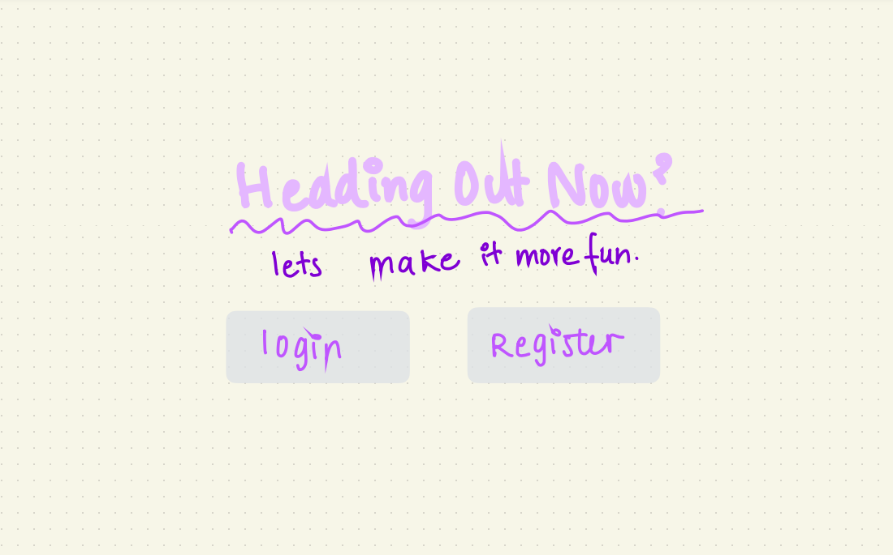
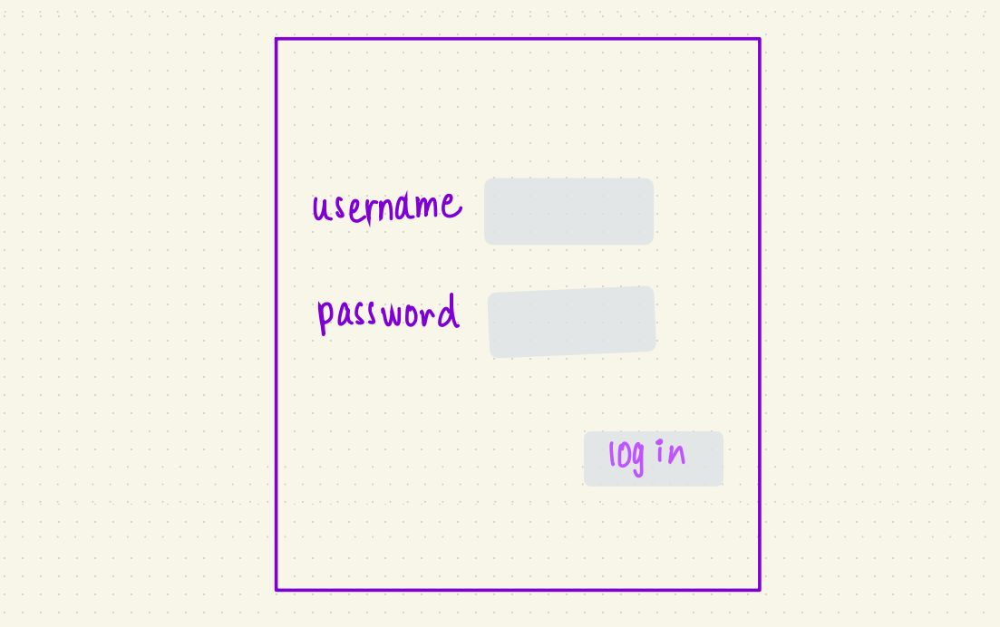
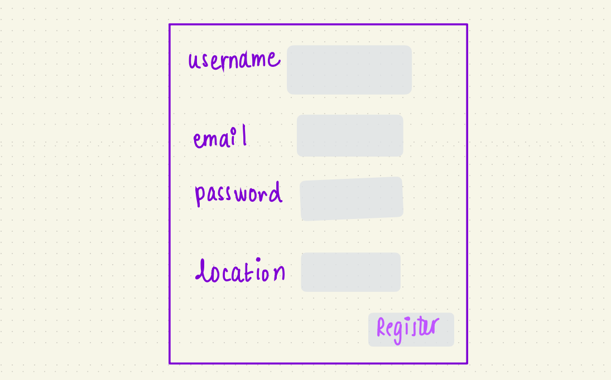
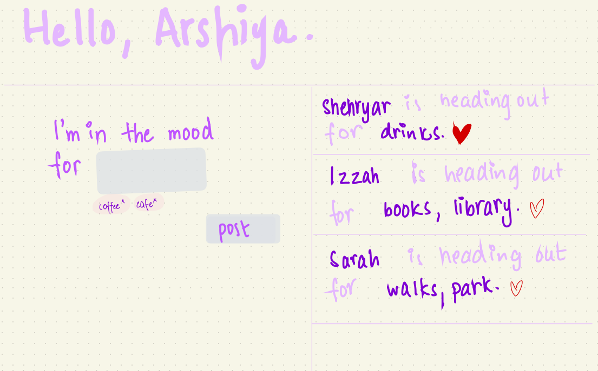
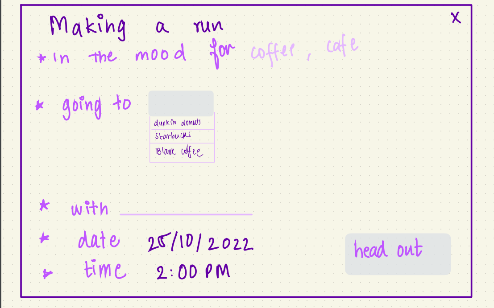
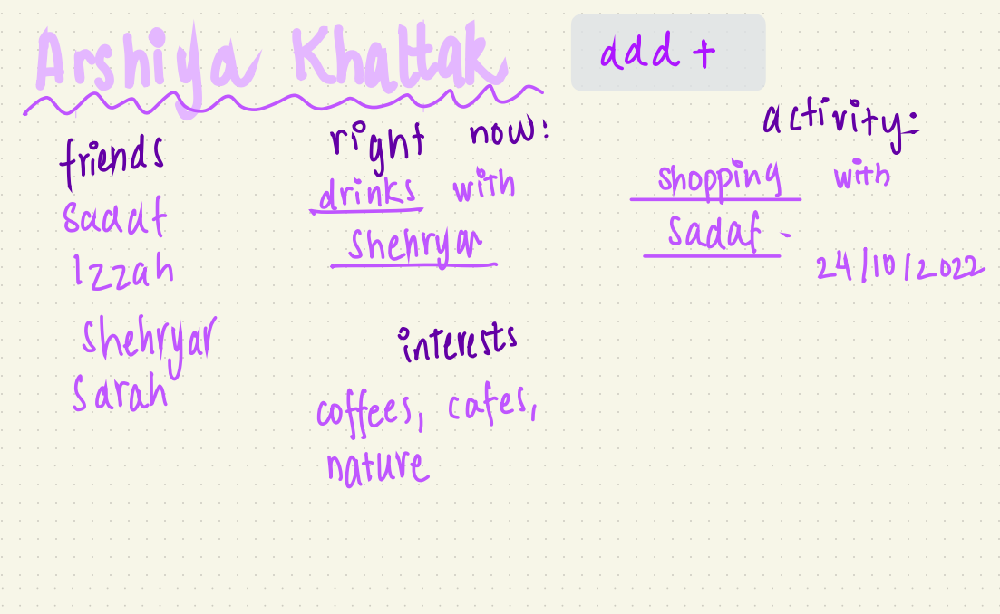
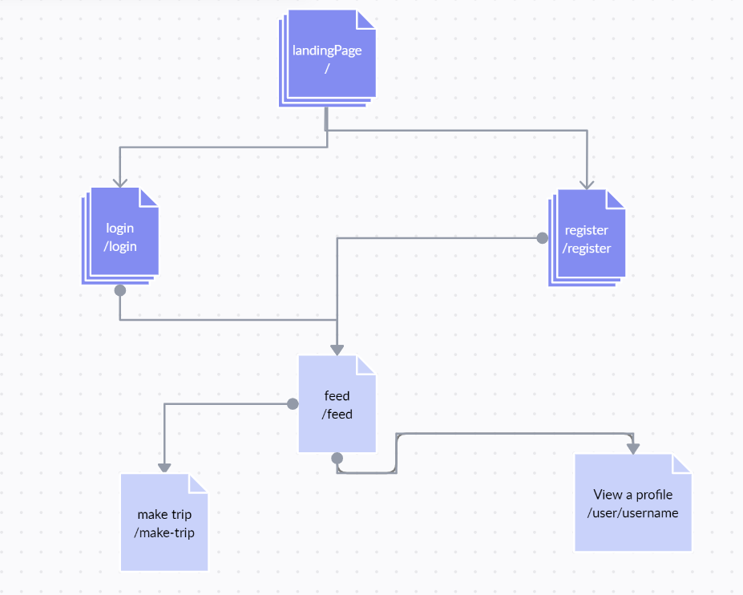

<!--The content below is an example project proposal / requirements document. Replace the text below the lines marked "__TODO__" with details specific to your project. Remove the "TODO" lines.-->

<!-- (__TODO__: your project name) -->

#  FriendQuest
## Overview

<!-- (__TODO__: a brief one or two paragraph, high-level description of your project) -->
Ever had those days where you randomly felt like going shopping, or wanted a quick run for ice cream? 

Have you, as an adult, also struggled to keep up with many of your friends because of conflicting schedules and long days of work and errands?

Those two might seem completely unrelated - but that's where FriendQuest comes in. It aims to make those two things connect. FriendQuest is a social platform that aims to make spontaneous (and non-spontaneous) plans with friends much easier. FriendQuest is a web app that will allow users to register and add a network of friends. On the app, if the user wants to go out, they can make a 'quick run' with keywords and a notification is sent to their network (within a certain radius). Other people can then click and join on the trip!

### Important Disclaimer

This is currently a work in progress, so all the features in the overview above are not implemented yet ---but all the requirements for the 
final project are complete. Important points: 
* You can only login with your NYU account.
* As of now, the ability to __set up an account__, __make a trip__ and __send a request__ are the features that are added. 
<!-- * As of now, the code has a bug that if you sign out, instead of redirecting you to the index page, it keeps you on whatever page you are on. 
Which is why, depending on which page you sign out,  -->
* while you can send a request, there is no functionality to add a friend (yet) 

## Data Model

<!-- (__TODO__: a description of your application's data and their relationships to each other) 

The application will store Users, Lists and Items

* users can have multiple lists (via references)
* each list can have multiple items (by embedding) -->

<!-- The application will store Users, History, and Status documents

* one user will have one status 
* one user will have many friends (a list of other users) -->

The application weill Account, Notifications, and Trip documents

* every user will have an account
* every user can have multiple friends (a list of accounts)
* each user can create a Trip document, and that trip document will be added to their history
* every user has an inbox (an array of notifications)
    * user A sends a notification to user B, adding a notification to user B's inbox
<!-- (__TODO__: sample documents) -->


User example

```javascript
{
  username: //username for login
  name: //name
  location: //location where based
  friends: // an array of references to user documents
  inbox: // embedded status Object, can only have one, replaced everytime
  history: //refernece to previous statuses
}
```

Trip Example

```javascript
{
  date: String,
  time: String,
  keywords: String,
  stage: {type: String, enum: ['planning', 'in progress', 'done', 'nevermind']},
  company: [{
      type: Schema.Types.ObjectId, ref: 'User'
  }],//users who joined, accepted notification
  location: String
}
```
Notification Example

```javascript
{
  from: {type: Schema.Types.ObjectId, ref: 'Account' },
   message: {type: String, enum: ['friend request']}
}
```
<!--- Status example

```javascript
{
  createdAt: //timestamp
  keywords: //list of words for what the user is in the mood for
  stage: //a string that can be either 'planning', 'in progress', 'done', 'nevermind'
}
```

=History example:
```javascript
{
  status: //embedded status object
  company: //reference list to users that accopanied, empty if trip done solo
}

``` -->

An Example User Profile
```javascript
{
  username: "arshiya.k"
  name: "Arshiya Khattak"
  location: "Greenwich Village, New York, N.Y." //this will be more specific in the actual program
  friends: [
    friend1ref, friend2ref, friend3ref //each of these is a user object
  ]
  inbox: [
    notifref
  ]
  history: [
    trip1ref, trip2ref
  ] 
}
```

## [Link to Commented First Draft Schema](db.mjs) 

<!-- (__TODO__: create a first draft of your Schemas in db.mjs and link to it) -->

## Wireframes

__NOTE__: these wireframes were made way earlier so are not entirely accurate to the working model, but the working model has pages/ components that accomplish the same things.

<!-- (__TODO__: wireframes for all of the pages on your site; they can be as simple as photos of drawings or you can use a tool like Balsamiq, Omnigraffle, etc.) -->

/ - landing page



/login - page for user login



/register - page for user register



/feed - user feed page, redirected to after login/register



/make-trip - page for when user is making a trip



/user/username - user profile page



## Site map


<!-- (__TODO__: draw out a site map that shows how pages are related to each other)

Here's a [complex example from wikipedia](https://upload.wikimedia.org/wikipedia/commons/2/20/Sitemap_google.jpg), but you can create one without the screenshots, drop shadows, etc. ... just names of pages and where they flow to. -->

## User Stories or Use Cases

<!-- (__TODO__: write out how your application will be used through [user stories](http://en.wikipedia.org/wiki/User_story#Format) and / or [use cases](https://en.wikipedia.org/wiki/Use_case)) -->

1. as non-registered user, I can register a new account with the site
2. as a user, I can log in to the site
3. as a user, I can add people to my friends list
4. as a user, I can view (and join) my friends trip/status 
5. as a user, I can create my own trip/status
6. as a user, I can view my own and other people's profile

## Research Topics
<!-- 
(__TODO__: the research topics that you're planning on working on along with their point values... and the total points of research topics listed) -->

* (4 points) Integrate user authentication
    * I'm going to be using next-auth for user authentication
    * Using google as a provider but with NYU credentials only
    * Have the ability to create a new profile, add to database of users
    
<!-- * (3 points) Client-Side form validation with custom JavaScript/or JavaScript library
    * make sure username & email are valid when registering
    * make sure when making a trip all input types are correct

      see <code>cs.nyu.edu/~jversoza/ait-final/register</code> for register page
    * see <code>cs.nyu.edu/~jversoza/ait-final/login</code> for login page  -->
* (4 points) Use an API for functionality related to location
    <!-- * see <code>cs.nyu.edu/~jversoza/ait-final/my-form</code> -->
    <!-- * if you put in a number that's greater than 5, an error message will appear in the dom -->
    * When creating a profile, users can input a home base with a drop down of locations
    <!-- * In the feed, users will only see the status of people within a certain radius of their location -->
    * When making a trip, the user will get a drop down list of locations as they type
    * Haven't ever used the Google API before this, which is why I am giving it 4 points
    * ```javascript 
      GoogleMaps usePlacesAutocomplete
      ```
* (6 points) Next.js (including React)
    * use NextJS for both frontend and backend; my first time using the framework (I haven't used React before either so I'm jumping in completely blind), so it'll be a bit challenging (there will be a learning curve), so I've assigned it 6 points 
<!-- * (1 point) AutoComplete Dropdown lists 
    * not much customization, but took a bit of time to understand the functionality -->


<!-- 10 points total out of 8 required points (___TODO__: addtional points will __not__ count for extra credit) -->


## [Link to Initial Main Project File](pages) 

<!-- (__TODO__: create a skeleton Express application with a package.json, app.mjs, views folder, etc. ... and link to your initial app.mjs) -->

## Annotations / References Used

__NOTE__: I began my application with [Create Next App](https://nextjs.org/docs/api-reference/create-next-app), so some of the files (such as the [icon](https://github.com/nyu-csci-ua-0467-001-002-fall-2022/final-project-arshiya-k/tree/master/public) and [CSS](https://github.com/nyu-csci-ua-0467-001-002-fall-2022/final-project-arshiya-k/tree/master/styles)) are from that. Also, I am using the default [Sign In Page](https://next-auth.js.org/configuration/pages#:~:text=NextAuth.js%20automatically,to%20NextAuth.js.) that comes with NextAuth.

1. I can't link to specific code in my repo for this (it's kind of the whole project), but because I was using NextJS for the first time, a lot of my understanding of NextJS (which inevitably inspired a lot of my code) was from these tutorials and the official documentation:
    * [Creating a website with Next.js and React](https://blog.logrocket.com/creating-website-next-js-react/)
    * [Build a Note-Taking App With Google Authentication in Next.js](https://betterprogramming.pub/build-a-note-taking-app-with-google-authentication-in-next-js-f0835d14034e)
    * [Next.js Official documentation](https://nextjs.org/docs)

2. [GoogleMaps usePlaceAutoComplete](https://www.youtube.com/watch?v=BL2XVTqz9Ek) - [1](https://github.com/nyu-csci-ua-0467-001-002-fall-2022/final-project-arshiya-k/blob/master/components/place-select.js) [2](https://github.com/nyu-csci-ua-0467-001-002-fall-2022/final-project-arshiya-k/blob/master/components/make_trip.js#L90-L93)

3. [ChakraUI Autocomplete Dropdown](https://www.npmjs.com/package/@choc-ui/chakra-autocomplete) - [1](https://github.com/nyu-csci-ua-0467-001-002-fall-2022/final-project-arshiya-k/blob/master/pages/dashboard.js#L152-L173)

4. [ChakraUI NavBar](https://chakra-templates.dev/navigation/navbar) - [1](https://github.com/nyu-csci-ua-0467-001-002-fall-2022/final-project-arshiya-k/blob/master/components/navbar.js)

5. NextAuth, multiple tutorials: [this](https://next-auth.js.org/getting-started/example), [this](https://medium.com/geekculture/why-and-how-to-get-started-with-next-auth-61740558b45b), [this](https://blog.openreplay.com/user-authentication-with-google-next-auth/), and [this](https://blog.logrocket.com/nextauth-js-for-next-js-client-side-authentication/) - [1](https://github.com/nyu-csci-ua-0467-001-002-fall-2022/final-project-arshiya-k/tree/master/pages/api/auth)

6. [using mongoose with next](https://stackoverflow.com/questions/19051041/cannot-overwrite-model-once-compiled-mongoose) - [1](https://github.com/nyu-csci-ua-0467-001-002-fall-2022/final-project-arshiya-k/blob/master/db.mjs#L97-L100)

7. [setting max date in HTML form](https://stackoverflow.com/questions/32378590/set-date-input-fields-max-date-to-today) - [1](https://github.com/nyu-csci-ua-0467-001-002-fall-2022/final-project-arshiya-k/blob/master/components/make_trip.js#L26-L40)


<!-- (__TODO__: list any tutorials/references/etc. that you've based your code off of)

1. [passport.js authentication docs](http://passportjs.org/docs) - (add link to source code that was based on this)
2. [tutorial on vue.js](https://vuejs.org/v2/guide/) - (add link to source code that was based on this) -->

